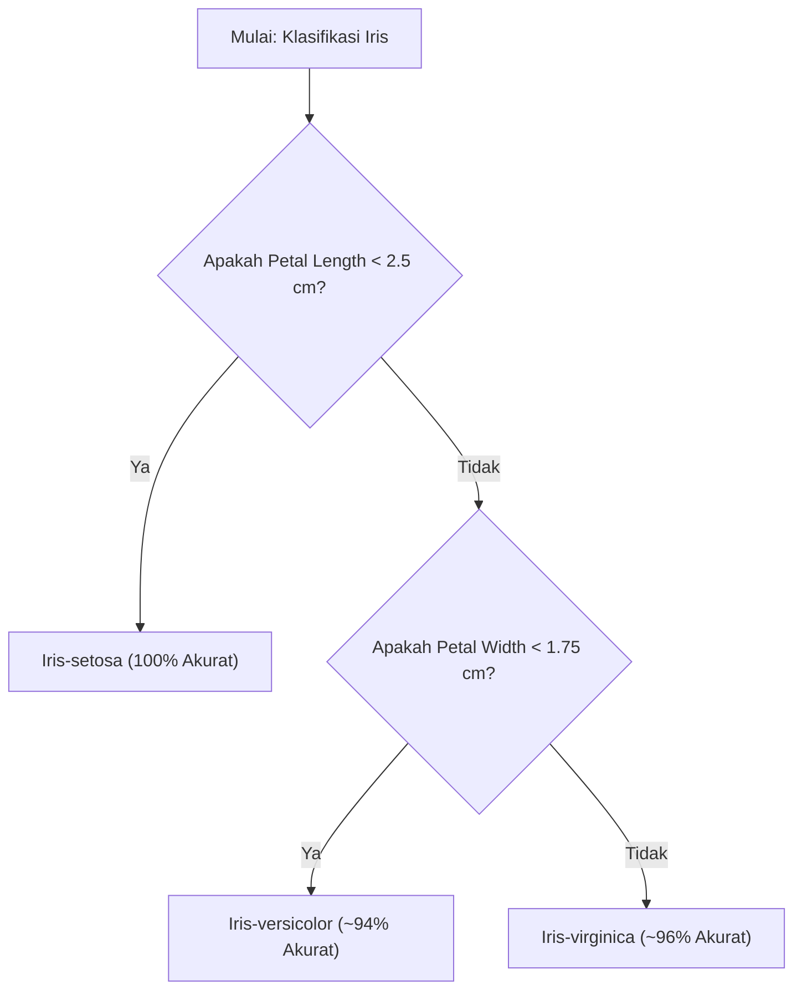

# Analisis Mendalam Dataset Iris

Analisis ini menyajikan wawasan (insights) utama dari dataset Iris yang mencakup 150 sampel dari tiga spesies tanaman bunga Iris: **Setosa**, **Versicolor**, dan **Virginica** (masing-masing 50 sampel).

---

## 📊 1. Ringkasan Statistik Utama (Rata-rata)

Berdasarkan analisis statistik deskriptif, berikut adalah rata-rata ukuran (dalam cm) untuk masing-masing spesies:

| Spesies | Sepal Length (Kelopak) | Sepal Width (Kelopak) | Petal Length (Mahkota) | Petal Width (Mahkota) | Karakteristik Utama |
| :--- | :---: | :---: | :---: | :---: | :--- |
| **Iris-setosa** | 5.01 cm | **3.42 cm (Paling Lebar)** | 1.46 cm (Sangat Kecil) | 0.24 cm (Sangat Tipis) | Mahkota sangat kecil, kelopak pendek tapi lebar. |
| **Iris-versicolor** | 5.94 cm | 2.77 cm | 4.26 cm (Sedang) | 1.33 cm (Sedang) | Ukuran sedang dan proporsional di semua bagian. |
| **Iris-virginica** | **6.59 cm (Paling Panjang)** | 2.97 cm | **5.55 cm (Paling Besar)** | **2.03 cm (Paling Tebal)** | Mahkota dan kelopak paling besar dan dominan. |

---

## 🔍 2. Temuan Utama (Key Insights)

### 🌟 A. Pemisahan Sempurna Iris-setosa
Iris-setosa dapat dipisahkan secara **100% linear** dari kedua spesies lainnya hanya dengan menggunakan fitur **Petal Length** atau **Petal Width**.
* Jika bunga memiliki **Petal Length < 2.5 cm**, bunga tersebut dipastikan adalah **Iris-setosa**.

### 📈 B. Korelasi Sangat Kuat Antar Fitur
Berdasarkan matriks korelasi, terdapat hubungan yang sangat kuat antara ukuran mahkota dan kelopak:
* **Petal Length & Petal Width (0.96)**: Menunjukkan bahwa semakin panjang mahkota bunga, semakin lebar pula ukurannya.
* **Sepal Length & Petal Length (0.87)**: Kelopak bunga yang lebih panjang cenderung diikuti oleh mahkota bunga yang lebih panjang.
* **Sepal Width memiliki korelasi negatif** dengan fitur lainnya, yang berarti kelopak yang lebar cenderung memiliki ukuran panjang mahkota yang lebih pendek.

---

## 🖼️ 3. Distribusi dan Visualisasi Data

### 🔗 Hubungan Antara Panjang & Lebar Mahkota (Petal)
Scatter plot di bawah menunjukkan bagaimana spesies terkelompok dengan jelas. Setosa (kuning) terpisah sangat jauh, sedangkan Versicolor (hijau) dan Virginica (ungu) memiliki sedikit irisan (overlap) di batas tengah.

### 📦 Distribusi Ukuran per Fitur
Boxplot di bawah ini memperlihatkan rentang variabilitas data. Terlihat bahwa **Iris-virginica** memiliki variansi ukuran yang lebih besar dibanding spesies lainnya.

---

## 🧠 4. Alur Keputusan Klasifikasi Sederhana

Berikut adalah diagram keputusan berbasis aturan (Rule-based Decision Tree) sederhana yang dapat digunakan untuk mengklasifikasikan spesies dengan tingkat akurasi mendekati 98%:

> [!NOTE]
> Irisan (overlap) antara Versicolor dan Virginica terjadi pada kisaran Petal Width 1.5 cm - 1.8 cm dan Petal Length 4.5 cm - 5.1 cm. Untuk klasifikasi sempurna pada bagian ini, disarankan menggunakan algoritma Machine Learning seperti SVM (Support Vector Machine) atau Random Forest.
